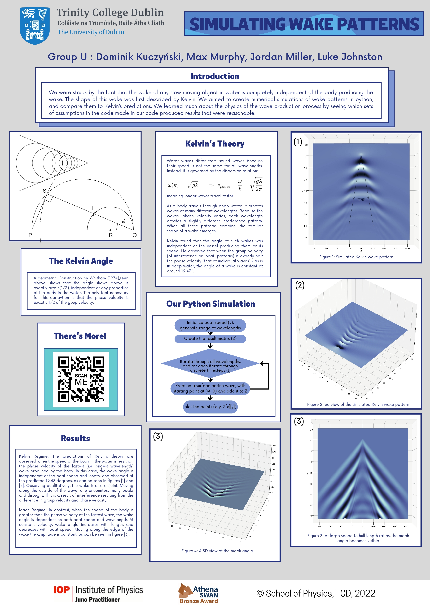
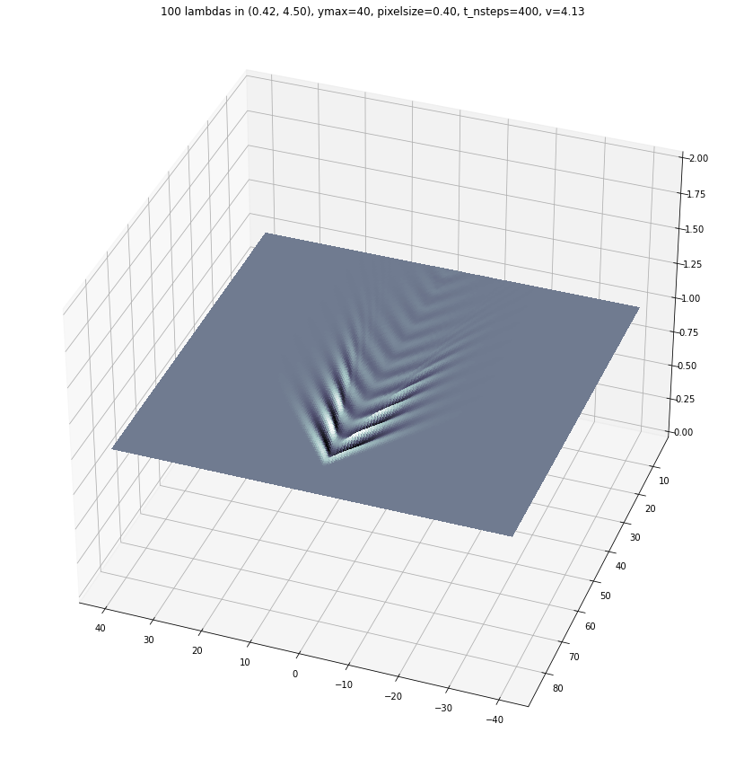

# Boat wakes simulated in Python

Python code for a iterative simulation of deep water wakes behind a moving pressure point (boat). The code was created for a physics poster project
at Trinity College Dublin.

<!--  -->